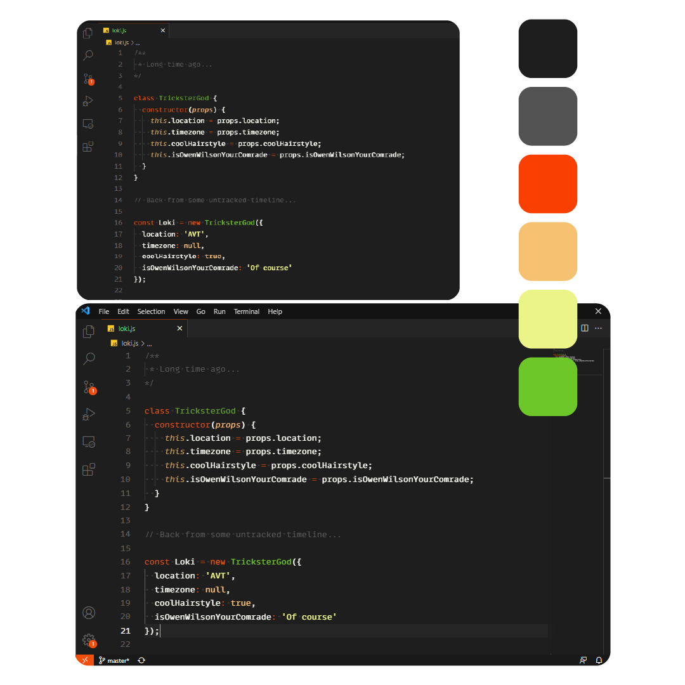

    
    

# Loki Official
## Loki Official Dark Theme, a pretty dark theme based on Loki retro futuristic aesthetic

*Every color present on theme was taken from the TV show

# Especial Thanks

Especial thanks to [@DevRadhy](https://www.github.com/devradhy) and [@Martin Hartfelder](https://github.com/TheMartinfer22) for being such helpful friends, and to [HUB Community](https://www.ahub.tech/discord) for teaching me valuable things everyday🧡🪐

# Contributing
Contributions are always welcome.

There's a bunch of ways you can contribute to this project, like by:
-  Making a port of this theme for another apps **(ask first, please)**
-  Requesting a port
-  Reporting a bug
-  Improving this documentation
-  Sharing this project and recommending it to your friends
-  Dropping a star on this repository🧡
[@Repository](https://github.com/seufernandez/loki-theme)

**Enjoy!**

## This theme was made while listening to:
- Amy Whinehouse
- Arctic Monkeys
- Green Day
- Reginaldo Rossi
- Spice Girls
- Tim Maia
- XXXTENTACION

# License
[MIT © License](https://github.com/seufernandez/loki-theme/blob/master/LICENSE.txt)

